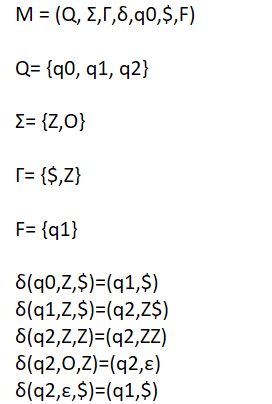

# Push down automata UPN
To enable compound expressions to be written without parentheses, the Polish mathematician Jan Lukasiewicz designed a notation that lists the operators after the numbers and variables (and not in between). The notation is called Reverse Polish Notation1.

Instead of `3 + 4`, one writes `3 4 +`. This allows compound expressions to be written without parentheses and interpreted unambiguously. Another example: For `(3+4)∗(6-2)` one writes `3 4 + 6 2 - ∗`. So first `3+4` is calculated, then `6 - 2` and finally the two factors are multiplied together. The result of the
calculation is `28`.

You can imagine that the numbers are written one after the other into the cellar or onto the stack. If an operator is read in (or comes as input), the two uppermost numbers are taken from the stack, calculated with each other and the result is put back on the stack.

## PDA UPN validation

> **Note**: `Z` is a number, `O` is an operator

## PDA UPN calculation

> **Note**: `Z` is a number, `O` is an operator

